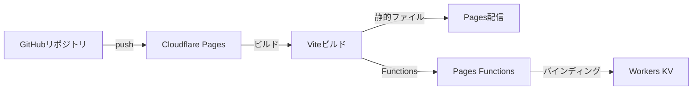
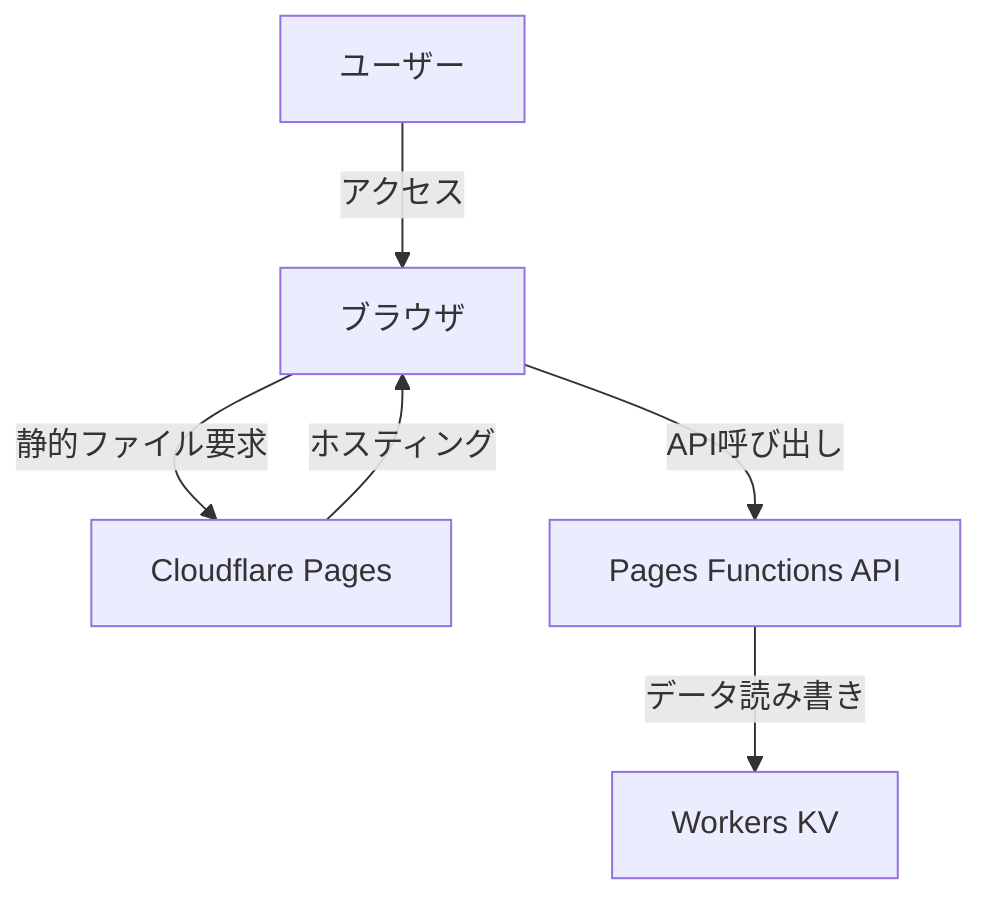

# 設計書

## 概要

SpliTripは、旅行やイベント時の立替精算を管理する軽量Webアプリケーションです。本システムは、React + TypeScript + Viteで構築されたフロントエンドと、Cloudflare Pages Functions + Workers KVで構築されたバックエンドで構成されます。

主要な設計原則：
- 認証なしのURL共有型アクセス
- 単一JSONによる旅行データ管理
- スマートフォン最適化UI
- 厳密な同時更新制御なし（軽量運用）
- 精算差額の合計は必ずゼロ

## アーキテクチャ

### 環境設定ファイル管理

本プロジェクトでは、環境設定を一元管理するために以下のファイルを使用します。

#### .env.local（Git管理外）

開発者固有の環境変数を保存します。このファイルは`.gitignore`に追加し、Git管理外とします。

```env
# Cloudflare認証情報
CLOUDFLARE_ACCOUNT_ID=your-account-id
CLOUDFLARE_API_TOKEN=your-api-token

# KVネームスペースID（ローカル開発用）
TRIPS_KV_ID=your-local-kv-namespace-id
TRIPS_KV_PREVIEW_ID=your-preview-kv-namespace-id

# 管理ユーザー情報（開発用）
ADMIN_EMAIL=your-email@example.com
ADMIN_NAME=Your Name
```

#### config/project.config.json（Git管理）

プロジェクト全体の設定を保存します。このファイルはGit管理対象です。

```json
{
  "projectName": "SpliTrip",
  "version": "1.0.0",
  "repository": {
    "type": "git",
    "url": "https://github.com/your-username/splitrip.git"
  },
  "cloudflare": {
    "projectName": "splitrip",
    "productionBranch": "main",
    "previewBranch": "develop"
  },
  "features": {
    "maxMembersPerTrip": 50,
    "maxReceiptsPerTrip": 500,
    "maxTripNameLength": 100,
    "maxMemberNameLength": 50
  }
}
```

#### config/cloudflare.config.json（Git管理）

Cloudflare固有の設定を保存します。このファイルはGit管理対象です。機密情報は含めません。

```json
{
  "pages": {
    "buildCommand": "npm run build",
    "buildOutputDirectory": "dist",
    "nodeVersion": "18"
  },
  "kv": {
    "namespace": "TRIPS_KV",
    "keyPrefix": "trip:"
  },
  "environment": {
    "production": {
      "url": "https://splitrip.pages.dev"
    },
    "preview": {
      "url": "https://preview.splitrip.pages.dev"
    }
  }
}
```

#### .gitignore

機密情報を含むファイルをGit管理外にします。

```gitignore
# 環境変数
.env
.env.local
.env.*.local

# 依存関係
node_modules/

# ビルド出力
dist/
.wrangler/

# IDE設定
.vscode/
.idea/

# OS固有
.DS_Store
Thumbs.db
```

### プロジェクト構造

```
splitrip/
├── .env.local                    # ローカル環境設定（Git管理外）
├── config/                       # 環境設定ファイル
│   ├── project.config.json      # プロジェクト設定（Git管理）
│   └── cloudflare.config.json   # Cloudflare設定（Git管理）
├── src/                          # フロントエンドソースコード
│   ├── pages/                    # ページコンポーネント
│   │   ├── AdminPage.tsx
│   │   ├── TripPage.tsx
│   │   ├── ReceiptInputPage.tsx
│   │   ├── ReceiptListPage.tsx
│   │   ├── ReceiptEditPage.tsx
│   │   ├── SummaryPage.tsx
│   │   └── MemberDetailPage.tsx
│   ├── components/               # 共通コンポーネント
│   │   ├── MemberSelector.tsx
│   │   ├── SplitModeSelector.tsx
│   │   ├── RatioInput.tsx
│   │   ├── FixedAmountInput.tsx
│   │   ├── SettlementSummary.tsx
│   │   └── ReceiptCard.tsx
│   ├── types/                    # 型定義
│   │   ├── trip.ts
│   │   ├── member.ts
│   │   ├── receipt.ts
│   │   └── settlement.ts
│   ├── utils/                    # ユーティリティ
│   │   ├── splitCalculator.ts   # 分割計算ロジック
│   │   ├── settlementCalculator.ts  # 精算計算ロジック
│   │   ├── serialization.ts     # シリアライゼーション
│   │   ├── validation.ts        # バリデーション
│   │   └── idGenerator.ts       # ID生成
│   ├── api/                      # APIクライアント
│   │   └── tripApi.ts           # フロントエンド用APIクライアント
│   ├── App.tsx                   # ルートコンポーネント
│   ├── main.tsx                  # エントリーポイント
│   └── router.tsx                # ルーティング設定
├── functions/                    # Cloudflare Pages Functions
│   └── api/                      # APIエンドポイント
│       ├── trips/
│       │   ├── index.ts         # POST /api/trips (旅行作成)
│       │   └── [tripId].ts      # GET/PUT/DELETE /api/trips/:tripId
│       └── _middleware.ts       # 共通ミドルウェア
├── shared/                       # フロントエンドとバックエンドで共有
│   ├── types/                    # 共有型定義
│   │   ├── trip.ts
│   │   ├── member.ts
│   │   ├── receipt.ts
│   │   └── api.ts
│   ├── utils/                    # 共有ユーティリティ
│   │   ├── splitCalculator.ts
│   │   ├── settlementCalculator.ts
│   │   ├── serialization.ts
│   │   ├── validation.ts
│   │   └── idGenerator.ts
│   └── repository/               # データアクセス層
│       └── tripRepository.ts
├── public/                       # 静的ファイル
│   └── favicon.ico
├── tests/                        # テストコード
│   ├── unit/                     # ユニットテスト
│   │   ├── splitCalculator.test.ts
│   │   ├── settlementCalculator.test.ts
│   │   └── validation.test.ts
│   ├── property/                 # プロパティベーステスト
│   │   ├── splitCalculator.property.test.ts
│   │   ├── settlementCalculator.property.test.ts
│   │   └── tripRepository.property.test.ts
│   └── integration/              # 統合テスト
│       └── api.integration.test.ts
├── docs/                         # ドキュメント
│   ├── SETUP.md                 # 環境セットアップ手順
│   └── DEPLOYMENT.md            # デプロイ手順
├── package.json                  # 依存関係
├── tsconfig.json                 # TypeScript設定
├── vite.config.ts                # Vite設定
├── wrangler.toml                 # Cloudflare Workers設定
├── .gitignore
└── README.md
```

### Cloudflare Pages + Functions + Workers KV連携設計

#### デプロイメントフロー



#### Cloudflare Pages設定

**ビルド設定:**
- ビルドコマンド: `npm run build`
- ビルド出力ディレクトリ: `dist`
- ルートディレクトリ: `/`

**環境変数:**
- `NODE_VERSION`: `18`

#### wrangler.toml設定

```toml
name = "splitrip"
compatibility_date = "2024-01-01"

# Pages Functions設定
pages_build_output_dir = "dist"

# KVネームスペース設定
[[kv_namespaces]]
binding = "TRIPS_KV"
id = "your-production-kv-namespace-id"
preview_id = "your-preview-kv-namespace-id"

# 環境変数（必要に応じて）
[vars]
ENVIRONMENT = "production"
```

#### Pages Functions構造

**ファイルベースルーティング:**

```
functions/
  api/
    trips/
      index.ts          → POST /api/trips
      [tripId].ts       → GET/PUT/DELETE /api/trips/:tripId
```

**環境型定義（shared/types/env.ts）:**

```typescript
export interface Env {
  TRIPS_KV: KVNamespace
  ENVIRONMENT?: string
}
```

**APIハンドラー例（functions/api/trips/index.ts）:**

```typescript
import { Env } from '../../../shared/types/env'
import { TripRepository } from '../../../shared/repository/tripRepository'
import { generateTripId } from '../../../shared/utils/idGenerator'
import { Trip } from '../../../shared/types/trip'

export async function onRequestPost(context: { request: Request; env: Env }) {
  try {
    const body = await context.request.json()
    
    // バリデーション
    if (!body.tripName || typeof body.tripName !== 'string') {
      return new Response(
        JSON.stringify({ error: '旅行名を入力してください' }),
        { status: 400, headers: { 'Content-Type': 'application/json' } }
      )
    }
    
    // 旅行作成
    const trip: Trip = {
      tripId: generateTripId(),
      tripName: body.tripName,
      version: 1,
      createdAt: new Date().toISOString(),
      updatedAt: new Date().toISOString(),
      members: body.members || [],
      receipts: []
    }
    
    // KVに保存
    const repository = new TripRepository(context.env.TRIPS_KV)
    await repository.save(trip)
    
    return new Response(JSON.stringify(trip), {
      status: 201,
      headers: { 'Content-Type': 'application/json' }
    })
  } catch (error) {
    console.error('Error creating trip:', error)
    return new Response(
      JSON.stringify({ error: 'サーバーエラーが発生しました' }),
      { status: 500, headers: { 'Content-Type': 'application/json' } }
    )
  }
}
```

**動的ルートハンドラー例（functions/api/trips/[tripId].ts）:**

```typescript
import { Env } from '../../../shared/types/env'
import { TripRepository } from '../../../shared/repository/tripRepository'

export async function onRequestGet(context: {
  request: Request
  env: Env
  params: { tripId: string }
}) {
  try {
    const repository = new TripRepository(context.env.TRIPS_KV)
    const trip = await repository.get(context.params.tripId)
    
    if (!trip) {
      return new Response(
        JSON.stringify({ error: '旅行が見つかりません' }),
        { status: 404, headers: { 'Content-Type': 'application/json' } }
      )
    }
    
    return new Response(JSON.stringify(trip), {
      status: 200,
      headers: { 'Content-Type': 'application/json' }
    })
  } catch (error) {
    console.error('Error getting trip:', error)
    return new Response(
      JSON.stringify({ error: 'サーバーエラーが発生しました' }),
      { status: 500, headers: { 'Content-Type': 'application/json' } }
    )
  }
}

export async function onRequestPut(context: {
  request: Request
  env: Env
  params: { tripId: string }
}) {
  try {
    const body = await context.request.json()
    const repository = new TripRepository(context.env.TRIPS_KV)
    
    // 既存の旅行を取得
    const existingTrip = await repository.get(context.params.tripId)
    if (!existingTrip) {
      return new Response(
        JSON.stringify({ error: '旅行が見つかりません' }),
        { status: 404, headers: { 'Content-Type': 'application/json' } }
      )
    }
    
    // バージョンをインクリメント
    const updatedTrip = {
      ...body,
      tripId: context.params.tripId,
      version: existingTrip.version + 1,
      updatedAt: new Date().toISOString()
    }
    
    await repository.save(updatedTrip)
    
    return new Response(JSON.stringify(updatedTrip), {
      status: 200,
      headers: { 'Content-Type': 'application/json' }
    })
  } catch (error) {
    console.error('Error updating trip:', error)
    return new Response(
      JSON.stringify({ error: 'サーバーエラーが発生しました' }),
      { status: 500, headers: { 'Content-Type': 'application/json' } }
    )
  }
}

export async function onRequestDelete(context: {
  request: Request
  env: Env
  params: { tripId: string }
}) {
  try {
    const repository = new TripRepository(context.env.TRIPS_KV)
    await repository.delete(context.params.tripId)
    
    return new Response(JSON.stringify({ success: true }), {
      status: 200,
      headers: { 'Content-Type': 'application/json' } }
    )
  } catch (error) {
    console.error('Error deleting trip:', error)
    return new Response(
      JSON.stringify({ error: 'サーバーエラーが発生しました' }),
      { status: 500, headers: { 'Content-Type': 'application/json' } }
    )
  }
}
```

#### フロントエンドとバックエンドのコード共有

**共有コードの配置:**
- `shared/` ディレクトリに配置
- フロントエンド（Vite）とバックエンド（Pages Functions）の両方からインポート可能

**TypeScript設定（tsconfig.json）:**

```json
{
  "compilerOptions": {
    "target": "ES2020",
    "module": "ESNext",
    "lib": ["ES2020", "DOM", "DOM.Iterable"],
    "moduleResolution": "bundler",
    "strict": true,
    "esModuleInterop": true,
    "skipLibCheck": true,
    "paths": {
      "@shared/*": ["./shared/*"],
      "@/*": ["./src/*"]
    }
  },
  "include": ["src", "shared", "functions"],
  "exclude": ["node_modules", "dist"]
}
```

**Vite設定（vite.config.ts）:**

```typescript
import { defineConfig } from 'vite'
import react from '@vitejs/plugin-react'
import path from 'path'

export default defineConfig({
  plugins: [react()],
  resolve: {
    alias: {
      '@': path.resolve(__dirname, './src'),
      '@shared': path.resolve(__dirname, './shared')
    }
  },
  build: {
    outDir: 'dist',
    emptyOutDir: true
  }
})
```

#### ローカル開発環境

**開発サーバー起動:**

```bash
# フロントエンド開発サーバー（Vite）
npm run dev

# Pages Functions開発サーバー（Wrangler）
npm run dev:functions
```

**package.json scripts:**

```json
{
  "scripts": {
    "dev": "vite",
    "dev:functions": "wrangler pages dev dist --kv TRIPS_KV",
    "build": "tsc && vite build",
    "preview": "vite preview",
    "test": "vitest",
    "test:unit": "vitest run tests/unit",
    "test:property": "vitest run tests/property",
    "test:integration": "vitest run tests/integration"
  }
}
```

#### デプロイメント

**Cloudflare Pagesへのデプロイ:**

1. GitHubリポジトリをCloudflare Pagesに接続
2. ビルド設定を構成
3. KVネームスペースを作成してバインディング設定
4. mainブランチへのpushで自動デプロイ

**手動デプロイ（Wrangler CLI）:**

```bash
# KVネームスペース作成
wrangler kv:namespace create "TRIPS_KV"
wrangler kv:namespace create "TRIPS_KV" --preview

# デプロイ
npm run build
wrangler pages deploy dist
```

### システム構成図



### デプロイメント構成

- **フロントエンド**: Cloudflare Pagesで静的ホスティング
- **API**: Cloudflare Pages Functionsでサーバーレス実行
- **ストレージ**: Cloudflare Workers KVでキーバリュー保存

### データフロー

1. ユーザーがブラウザで旅行URLにアクセス
2. Cloudflare Pagesが静的フロントエンドを配信
3. フロントエンドがPages Functions APIを呼び出し
4. APIがWorkers KVから旅行JSONを取得
5. フロントエンドがデータを表示・編集
6. 更新時はAPIを通じてWorkers KVに保存

## コンポーネントとインターフェース

### フロントエンドコンポーネント

#### ページコンポーネント

1. **AdminPage** (`/admin`)
   - 旅行一覧表示
   - 新規旅行作成フォーム
   - メンバー登録フォーム
   - 旅行URL表示

2. **TripPage** (`/trip/:tripId`)
   - 旅行名表示
   - メニューナビゲーション（レシート入力、レシート修正、精算確認）

3. **ReceiptInputPage** (`/trip/:tripId/receipt/new`)
   - Step1: 合計金額、用途、支払い者入力
   - Step2: 割り対象選択（全員割/メンバー選定）
   - Step3: 配分方法選択（一律割/比率配分/金額指定配分）

4. **ReceiptListPage** (`/trip/:tripId/receipts`)
   - レシート一覧表示
   - 編集リンク

5. **ReceiptEditPage** (`/trip/:tripId/receipt/:receiptId/edit`)
   - 既存レシート編集（入力フローと同じ）

6. **SummaryPage** (`/trip/:tripId/summary`)
   - メンバー別精算サマリー表示
   - 立替合計、負担合計、差額表示

7. **MemberDetailPage** (`/trip/:tripId/summary/:memberId`)
   - 立替一覧（用途、金額）
   - 負担一覧（用途、金額）
   - 合計と差額

#### 共通コンポーネント

- **MemberSelector**: メンバー選択UI
- **SplitModeSelector**: 分割モード選択UI
- **RatioInput**: 比率入力UI
- **FixedAmountInput**: 金額指定入力UI
- **SettlementSummary**: 精算サマリー表示
- **ReceiptCard**: レシート表示カード

### APIエンドポイント

#### POST /api/trips

新規旅行作成

**リクエスト:**
```typescript
{
  tripName: string
  members: { name: string }[]
}
```

**レスポンス:**
```typescript
{
  tripId: string
  tripName: string
  version: number
  createdAt: string
  updatedAt: string
  members: Member[]
  receipts: Receipt[]
}
```

#### GET /api/trips/:tripId

旅行データ取得

**レスポンス:**
```typescript
{
  tripId: string
  tripName: string
  version: number
  createdAt: string
  updatedAt: string
  members: Member[]
  receipts: Receipt[]
}
```

#### PUT /api/trips/:tripId

旅行データ更新

**リクエスト:**
```typescript
{
  tripId: string
  tripName: string
  version: number
  createdAt: string
  updatedAt: string
  members: Member[]
  receipts: Receipt[]
}
```

**レスポンス:**
```typescript
{
  tripId: string
  tripName: string
  version: number
  createdAt: string
  updatedAt: string
  members: Member[]
  receipts: Receipt[]
}
```

#### DELETE /api/trips/:tripId

旅行削除

**レスポンス:**
```typescript
{
  success: boolean
}
```

## データモデル

### アプリケーションデータモデル

以下は、アプリケーション内で使用されるTypeScriptの型定義です。

### Trip

```typescript
type Trip = {
  tripId: string          // 一意の旅行ID（例: trip_20260308_abc123）
  tripName: string        // 旅行名
  version: number         // バージョン番号（更新のたびにインクリメント）
  createdAt: string       // 作成日時（ISO 8601形式）
  updatedAt: string       // 更新日時（ISO 8601形式）
  members: Member[]       // メンバー配列
  receipts: Receipt[]     // レシート配列
}
```

### Member

```typescript
type Member = {
  id: string              // 一意のメンバーID（例: m1, m2, m3）
  name: string            // メンバー名
  createdAt: string       // 作成日時（ISO 8601形式）
}
```

### Receipt

```typescript
type Receipt = {
  id: string                          // 一意のレシートID（例: r1, r2, r3）
  title?: string                      // 用途（任意）
  amount: number                      // 合計金額
  payerId: string                     // 支払い者のメンバーID
  targetMode: "all" | "selected"      // 割り対象モード
  splitMode: "equal" | "ratio" | "fixed"  // 分割モード
  selectedMemberIds: string[]         // 選択されたメンバーID配列
  ratioInputs?: SplitRatioInput[]     // 比率入力（比率配分時のみ）
  fixedInputs?: SplitFixedInput[]     // 金額指定入力（金額指定配分時のみ）
  splits: SplitResult[]               // 分割結果
  createdAt: string                   // 作成日時（ISO 8601形式）
  updatedAt: string                   // 更新日時（ISO 8601形式）
}
```

### SplitRatioInput

```typescript
type SplitRatioInput = {
  memberId: string        // メンバーID
  ratio: number           // 比率（パーセンテージ、デフォルト100）
}
```

### SplitFixedInput

```typescript
type SplitFixedInput = {
  memberId: string        // メンバーID
  amount: number          // 金額
}
```

### SplitResult

```typescript
type SplitResult = {
  memberId: string        // メンバーID
  amount: number          // 分割金額
}
```

### 物理データストレージ設計

#### Cloudflare Workers KVの使用方針

Cloudflare Workers KVは、キーバリュー型のグローバル分散ストレージです。本システムでは、旅行単位でJSONデータを保存します。

#### ストレージキー設計

**キー形式:**
```
trip:{tripId}
```

**例:**
```
trip:trip_20260308_abc123
```

**キー生成ロジック:**
```typescript
function generateTripId(): string {
  const timestamp = new Date().toISOString().split('T')[0].replace(/-/g, '')
  const random = Math.random().toString(36).substring(2, 8)
  return `trip_${timestamp}_${random}`
}
```

#### データ保存形式

**値（Value）:** Trip型オブジェクトをJSON文字列にシリアライズしたもの

**保存例:**
```json
{
  "tripId": "trip_20260308_abc123",
  "tripName": "伊豆旅行",
  "version": 3,
  "createdAt": "2026-03-08T10:00:00.000Z",
  "updatedAt": "2026-03-08T15:30:00.000Z",
  "members": [
    {
      "id": "m1",
      "name": "山田",
      "createdAt": "2026-03-08T10:00:00.000Z"
    },
    {
      "id": "m2",
      "name": "鈴木",
      "createdAt": "2026-03-08T10:00:00.000Z"
    },
    {
      "id": "m3",
      "name": "田中",
      "createdAt": "2026-03-08T10:00:00.000Z"
    }
  ],
  "receipts": [
    {
      "id": "r1",
      "title": "スーパー買い出し",
      "amount": 30000,
      "payerId": "m1",
      "targetMode": "all",
      "splitMode": "ratio",
      "selectedMemberIds": ["m1", "m2", "m3"],
      "ratioInputs": [
        {"memberId": "m1", "ratio": 100},
        {"memberId": "m2", "ratio": 100},
        {"memberId": "m3", "ratio": 50}
      ],
      "splits": [
        {"memberId": "m1", "amount": 12000},
        {"memberId": "m2", "amount": 12000},
        {"memberId": "m3", "amount": 6000}
      ],
      "createdAt": "2026-03-08T12:00:00.000Z",
      "updatedAt": "2026-03-08T12:00:00.000Z"
    }
  ]
}
```

#### KV操作インターフェース

**保存操作:**
```typescript
async function saveTrip(env: Env, trip: Trip): Promise<void> {
  const key = `trip:${trip.tripId}`
  const value = JSON.stringify(trip)
  await env.TRIPS_KV.put(key, value)
}
```

**取得操作:**
```typescript
async function getTrip(env: Env, tripId: string): Promise<Trip | null> {
  const key = `trip:${tripId}`
  const value = await env.TRIPS_KV.get(key)
  
  if (!value) {
    return null
  }
  
  return JSON.parse(value) as Trip
}
```

**削除操作:**
```typescript
async function deleteTrip(env: Env, tripId: string): Promise<void> {
  const key = `trip:${tripId}`
  await env.TRIPS_KV.delete(key)
}
```

#### KVバインディング設定

**wrangler.toml:**
```toml
[[kv_namespaces]]
binding = "TRIPS_KV"
id = "your-kv-namespace-id"
preview_id = "your-preview-kv-namespace-id"
```

**環境型定義:**
```typescript
interface Env {
  TRIPS_KV: KVNamespace
}
```

#### データ整合性とバージョン管理

**バージョン番号の使用:**
- 各旅行データにはバージョン番号が含まれる
- 更新のたびにバージョン番号をインクリメント
- 厳密な競合制御は行わないが、バージョン番号でデータの新旧を判断可能

**更新フロー:**
```typescript
async function updateTrip(env: Env, trip: Trip): Promise<Trip> {
  // バージョンをインクリメント
  trip.version += 1
  trip.updatedAt = new Date().toISOString()
  
  // KVに保存
  await saveTrip(env, trip)
  
  return trip
}
```

#### データサイズ制限

**Workers KVの制限:**
- キーサイズ: 最大512バイト
- 値サイズ: 最大25MB

**本システムの想定:**
- 1旅行あたりのデータサイズ: 通常10KB〜100KB程度
- メンバー数: 最大50人程度
- レシート数: 最大500件程度
- 上記の想定では、KVの制限に十分余裕がある

#### データ保持期間

- Workers KVはデータを無期限に保持
- 本システムでは明示的な削除機能を提供
- 将来的には、一定期間アクセスのない旅行を自動削除する機能を検討可能

#### キャッシュ戦略

Workers KVは自動的にグローバルにキャッシュされます：
- 書き込み: 即座に反映（最終的整合性）
- 読み込み: エッジロケーションでキャッシュ（高速）
- 本システムでは、KVの自動キャッシュ機能を活用し、追加のキャッシュ層は不要

#### JSON-TypeScript変換設計

**変換の必要性:**
Workers KVはJSON文字列として保存するため、TypeScriptの型付きオブジェクトとの間で変換が必要です。

**変換レイヤーの責務:**
1. シリアライゼーション: TypeScriptオブジェクト → JSON文字列
2. デシリアライゼーション: JSON文字列 → TypeScriptオブジェクト
3. 型検証: JSONデータが期待される型に適合するか検証
4. デフォルト値の補完: 古いバージョンのデータに新しいフィールドを追加

**変換インターフェース:**

```typescript
// シリアライゼーション（型安全）
function serializeTrip(trip: Trip): string {
  return JSON.stringify(trip)
}

// デシリアライゼーション（型検証付き）
function deserializeTrip(json: string): Trip {
  const data = JSON.parse(json)
  return validateAndConvertTrip(data)
}

// 型検証と変換
function validateAndConvertTrip(data: any): Trip {
  // 必須フィールドの検証
  if (!data.tripId || typeof data.tripId !== 'string') {
    throw new Error('Invalid trip data: tripId is required')
  }
  if (!data.tripName || typeof data.tripName !== 'string') {
    throw new Error('Invalid trip data: tripName is required')
  }
  if (typeof data.version !== 'number') {
    throw new Error('Invalid trip data: version must be a number')
  }
  if (!Array.isArray(data.members)) {
    throw new Error('Invalid trip data: members must be an array')
  }
  if (!Array.isArray(data.receipts)) {
    throw new Error('Invalid trip data: receipts must be an array')
  }
  
  // メンバーの変換と検証
  const members: Member[] = data.members.map((m: any, index: number) => {
    if (!m.id || typeof m.id !== 'string') {
      throw new Error(`Invalid member at index ${index}: id is required`)
    }
    if (!m.name || typeof m.name !== 'string') {
      throw new Error(`Invalid member at index ${index}: name is required`)
    }
    if (!m.createdAt || typeof m.createdAt !== 'string') {
      throw new Error(`Invalid member at index ${index}: createdAt is required`)
    }
    
    return {
      id: m.id,
      name: m.name,
      createdAt: m.createdAt
    }
  })
  
  // レシートの変換と検証
  const receipts: Receipt[] = data.receipts.map((r: any, index: number) => {
    if (!r.id || typeof r.id !== 'string') {
      throw new Error(`Invalid receipt at index ${index}: id is required`)
    }
    if (typeof r.amount !== 'number' || r.amount <= 0) {
      throw new Error(`Invalid receipt at index ${index}: amount must be a positive number`)
    }
    if (!r.payerId || typeof r.payerId !== 'string') {
      throw new Error(`Invalid receipt at index ${index}: payerId is required`)
    }
    if (!['all', 'selected'].includes(r.targetMode)) {
      throw new Error(`Invalid receipt at index ${index}: targetMode must be 'all' or 'selected'`)
    }
    if (!['equal', 'ratio', 'fixed'].includes(r.splitMode)) {
      throw new Error(`Invalid receipt at index ${index}: splitMode must be 'equal', 'ratio', or 'fixed'`)
    }
    if (!Array.isArray(r.selectedMemberIds)) {
      throw new Error(`Invalid receipt at index ${index}: selectedMemberIds must be an array`)
    }
    if (!Array.isArray(r.splits)) {
      throw new Error(`Invalid receipt at index ${index}: splits must be an array`)
    }
    
    // 分割結果の検証
    const splits: SplitResult[] = r.splits.map((s: any, sIndex: number) => {
      if (!s.memberId || typeof s.memberId !== 'string') {
        throw new Error(`Invalid split at receipt ${index}, split ${sIndex}: memberId is required`)
      }
      if (typeof s.amount !== 'number') {
        throw new Error(`Invalid split at receipt ${index}, split ${sIndex}: amount must be a number`)
      }
      
      return {
        memberId: s.memberId,
        amount: s.amount
      }
    })
    
    // オプショナルフィールドの処理
    const ratioInputs: SplitRatioInput[] | undefined = r.ratioInputs
      ? r.ratioInputs.map((ri: any) => ({
          memberId: ri.memberId,
          ratio: ri.ratio
        }))
      : undefined
    
    const fixedInputs: SplitFixedInput[] | undefined = r.fixedInputs
      ? r.fixedInputs.map((fi: any) => ({
          memberId: fi.memberId,
          amount: fi.amount
        }))
      : undefined
    
    return {
      id: r.id,
      title: r.title,
      amount: r.amount,
      payerId: r.payerId,
      targetMode: r.targetMode,
      splitMode: r.splitMode,
      selectedMemberIds: r.selectedMemberIds,
      ratioInputs,
      fixedInputs,
      splits,
      createdAt: r.createdAt,
      updatedAt: r.updatedAt
    }
  })
  
  // Tripオブジェクトの構築
  return {
    tripId: data.tripId,
    tripName: data.tripName,
    version: data.version,
    createdAt: data.createdAt,
    updatedAt: data.updatedAt,
    members,
    receipts
  }
}
```

**変換レイヤーの配置:**

```
src/
  utils/
    serialization.ts    # シリアライゼーション・デシリアライゼーション
    validation.ts       # 型検証ロジック
  api/
    tripRepository.ts   # KV操作とデータ変換を統合
```

**リポジトリパターンの採用:**

```typescript
// tripRepository.ts
export class TripRepository {
  constructor(private kv: KVNamespace) {}
  
  async save(trip: Trip): Promise<void> {
    const key = `trip:${trip.tripId}`
    const json = serializeTrip(trip)
    await this.kv.put(key, json)
  }
  
  async get(tripId: string): Promise<Trip | null> {
    const key = `trip:${tripId}`
    const json = await this.kv.get(key)
    
    if (!json) {
      return null
    }
    
    try {
      return deserializeTrip(json)
    } catch (error) {
      console.error('Failed to deserialize trip:', error)
      throw new Error('Invalid trip data in storage')
    }
  }
  
  async delete(tripId: string): Promise<void> {
    const key = `trip:${tripId}`
    await this.kv.delete(key)
  }
}
```

**エラーハンドリング:**
- デシリアライゼーション時に型検証エラーが発生した場合、適切なエラーメッセージを返す
- 古いバージョンのデータに対しては、マイグレーションロジックを適用（将来的な拡張）

**マイグレーション戦略（将来的な拡張）:**

```typescript
function migrateTrip(data: any): any {
  // バージョン1からバージョン2へのマイグレーション例
  if (!data.version || data.version < 2) {
    // 新しいフィールドを追加
    data.version = 2
    // 必要に応じてデータ構造を変換
  }
  
  return data
}
```

### Settlement（計算結果）

```typescript
type Settlement = {
  memberId: string        // メンバーID
  memberName: string      // メンバー名
  paidTotal: number       // 立替合計
  owedTotal: number       // 負担合計
  balance: number         // 差額（paidTotal - owedTotal）
}
```

## 計算ロジック

### 分割計算

#### 一律割（Equal Split）

```typescript
function splitEvenly(total: number, memberIds: string[]): SplitResult[] {
  const count = memberIds.length
  const baseAmount = Math.floor(total / count)
  const remainder = total - (baseAmount * count)
  
  return memberIds.map((memberId, index) => ({
    memberId,
    amount: baseAmount + (index === 0 ? remainder : 0)
  }))
}
```

端数処理：最初のメンバーに端数を寄せる

#### 比率配分（Ratio Split）

```typescript
function splitByRatio(
  total: number,
  ratioInputs: SplitRatioInput[]
): SplitResult[] {
  const ratioSum = ratioInputs.reduce((sum, input) => sum + input.ratio, 0)
  
  let allocated = 0
  const results: SplitResult[] = []
  
  for (let i = 0; i < ratioInputs.length; i++) {
    const input = ratioInputs[i]
    let amount: number
    
    if (i === ratioInputs.length - 1) {
      // 最後のメンバーに残りを割り当て（端数調整）
      amount = total - allocated
    } else {
      amount = Math.floor(total * input.ratio / ratioSum)
      allocated += amount
    }
    
    results.push({
      memberId: input.memberId,
      amount
    })
  }
  
  return results
}
```

端数処理：最後のメンバーに端数を寄せる

#### 金額指定配分（Fixed Amount Split）

```typescript
function splitByFixed(
  total: number,
  fixedInputs: SplitFixedInput[]
): SplitResult[] {
  const sum = fixedInputs.reduce((s, input) => s + input.amount, 0)
  
  if (sum !== total) {
    throw new Error('Fixed amounts sum does not equal total')
  }
  
  return fixedInputs.map(input => ({
    memberId: input.memberId,
    amount: input.amount
  }))
}
```

検証：金額指定の合計が合計金額と一致することを確認

### 精算計算

```typescript
function calculateSettlements(trip: Trip): Settlement[] {
  const settlements = new Map<string, Settlement>()
  
  // 初期化
  for (const member of trip.members) {
    settlements.set(member.id, {
      memberId: member.id,
      memberName: member.name,
      paidTotal: 0,
      owedTotal: 0,
      balance: 0
    })
  }
  
  // 立替合計と負担合計を計算
  for (const receipt of trip.receipts) {
    // 立替合計
    const payer = settlements.get(receipt.payerId)!
    payer.paidTotal += receipt.amount
    
    // 負担合計
    for (const split of receipt.splits) {
      const member = settlements.get(split.memberId)!
      member.owedTotal += split.amount
    }
  }
  
  // 差額を計算
  for (const settlement of settlements.values()) {
    settlement.balance = settlement.paidTotal - settlement.owedTotal
  }
  
  return Array.from(settlements.values())
}
```

不変条件：すべてのメンバーの差額の合計は必ずゼロ

```typescript
function validateSettlements(settlements: Settlement[]): boolean {
  const totalBalance = settlements.reduce((sum, s) => sum + s.balance, 0)
  return Math.abs(totalBalance) < 0.01 // 浮動小数点誤差を考慮
}
```

## エラーハンドリング

### バリデーションエラー

1. **旅行作成時**
   - 旅行名が空: "旅行名を入力してください"
   - メンバー名が空: "メンバー名を入力してください"

2. **レシート作成時**
   - 合計金額が0以下: "合計金額は正の数を入力してください"
   - 支払い者が未選択: "支払い者を選択してください"
   - 対象メンバーが未選択: "対象メンバーを選択してください"
   - 金額指定の合計が不一致: "金額指定の合計が合計金額と一致しません"
   - 比率が0以下: "比率は正の数を入力してください"

### APIエラー

1. **404 Not Found**
   - 旅行が存在しない: "旅行が見つかりません"

2. **400 Bad Request**
   - リクエストボディが不正: "リクエストが不正です"
   - バリデーションエラー: 具体的なエラーメッセージ

3. **500 Internal Server Error**
   - KVストアエラー: "サーバーエラーが発生しました"

### フロントエンドエラー表示

- エラーメッセージは画面上部にトースト表示
- フォームエラーは該当フィールドの下に赤字で表示
- エラー発生時は操作を中断し、ユーザーに修正を促す

## テスト戦略

### ユニットテスト

1. **分割計算ロジック**
   - 一律割の正確性
   - 比率配分の正確性
   - 金額指定配分の検証
   - 端数処理の一貫性

2. **精算計算ロジック**
   - 立替合計の正確性
   - 負担合計の正確性
   - 差額計算の正確性
   - 差額合計がゼロになること

3. **バリデーション**
   - 入力値の検証
   - エラーメッセージの確認

### プロパティベーステスト

プロパティベーステストは、ランダムに生成された入力に対して普遍的な性質が成り立つことを検証するテスト手法です。各プロパティは、すべての有効な入力に対して成立すべき形式的な仕様です。


### 正確性プロパティ

プロパティは、システムのすべての有効な実行において真であるべき特性または動作です。本質的には、システムが何をすべきかについての形式的な記述です。プロパティは、人間が読める仕様と機械で検証可能な正確性保証の橋渡しとなります。

#### プロパティ1: 旅行作成時の初期化

*任意の*旅行名に対して、旅行を作成したとき、システムは一意の旅行IDを生成し、空のメンバーリストと空のレシートリストで初期化しなければならない

**検証: 要件 1.1, 1.2**

#### プロパティ2: メンバー追加の一意性

*任意の*旅行と任意のメンバー名に対して、メンバーを追加したとき、システムは一意のメンバーIDを割り当て、旅行のメンバーリストに追加しなければならない

**検証: 要件 1.3**

#### プロパティ3: データ永続化のラウンドトリップ

*任意の*旅行データに対して、シリアライズしてKVストアに保存し、取得してデシリアライズしたとき、元のデータと等価なデータが得られなければならない

**検証: 要件 1.4, 6.1, 6.3**

#### プロパティ4: バージョン番号のインクリメント

*任意の*旅行に対して、更新操作を実行したとき、システムはバージョン番号をインクリメントしなければならない

**検証: 要件 1.5, 6.4**

#### プロパティ5: 旅行削除の完全性

*任意の*旅行に対して、削除操作を実行したとき、システムはKVストアから旅行データを削除し、その後の取得操作は失敗しなければならない

**検証: 要件 1.6**

#### プロパティ6: レシート作成時の必須フィールド検証

*任意の*レシート作成リクエストに対して、合計金額、支払い者ID、分割設定のいずれかが欠けている場合、システムはレシート作成を拒否しなければならない

**検証: 要件 2.1**

#### プロパティ7: 全メンバー割の完全性

*任意の*旅行と任意のレシートに対して、対象モードが「全メンバー」の場合、システムは登録されているすべてのメンバーを分割計算に含めなければならない

**検証: 要件 2.2**

#### プロパティ8: 選択メンバー割の正確性

*任意の*旅行と任意のメンバー選択に対して、対象モードが「選択」の場合、システムは選択されたメンバーのみを分割計算に含めなければならない

**検証: 要件 2.3**

#### プロパティ9: 一律割の均等性

*任意の*合計金額と任意の対象メンバー数に対して、一律割モードで分割したとき、各メンバーの分割金額の差は最大1円以内でなければならない（端数処理を考慮）

**検証: 要件 2.4, 8.1**

#### プロパティ10: 比率配分の比例性

*任意の*合計金額と任意の比率入力に対して、比率配分モードで分割したとき、各メンバーの分割金額は「合計 * (メンバー比率 / 全比率の合計)」に基づいて計算されなければならない（端数処理を考慮して±1円以内）

**検証: 要件 2.5, 8.2**

#### プロパティ11: 金額指定配分の正確性

*任意の*合計金額と任意の金額指定入力に対して、金額指定配分モードで分割したとき、各メンバーの分割金額は指定された金額と正確に一致しなければならない

**検証: 要件 2.6, 8.3**

#### プロパティ12: 金額指定配分の合計検証

*任意の*合計金額と任意の金額指定入力に対して、金額指定の合計が合計金額と等しくない場合、システムはレシート作成を拒否しなければならない

**検証: 要件 2.7, 12.6**

#### プロパティ13: 分割結果の保存形式

*任意の*レシートに対して、分割結果はメンバーIDと金額のペアの配列として保存されなければならない

**検証: 要件 2.8**

#### プロパティ14: レシート一覧の完全性

*任意の*旅行に対して、レシート一覧を表示したとき、すべてのレシートがタイトル、金額、支払い者とともに表示されなければならない

**検証: 要件 3.1**

#### プロパティ15: レシート編集のラウンドトリップ

*任意の*レシートに対して、編集フォームに読み込んだデータは元のレシートデータと等価でなければならない

**検証: 要件 3.2**

#### プロパティ16: レシート更新時の再計算

*任意の*レシートに対して、分割設定を変更して更新したとき、システムは新しい設定に基づいて分割金額を再計算しなければならない

**検証: 要件 3.3**

#### プロパティ17: タイムスタンプの更新

*任意の*旅行、メンバー、レシートに対して、作成時にはcreatedAtが設定され、更新時にはupdatedAtが更新されなければならない

**検証: 要件 3.4, 6.5**

#### プロパティ18: 精算計算の正確性

*任意の*旅行に対して、精算を計算したとき、各メンバーの立替合計、負担合計、差額（立替合計 - 負担合計）が正確に計算されなければならない

**検証: 要件 4.1, 4.2, 4.3**

#### プロパティ19: 差額合計ゼロの不変条件

*任意の*旅行に対して、すべてのメンバーの差額の合計は必ずゼロでなければならない（浮動小数点誤差を考慮して±0.01円以内）

**検証: 要件 4.4**

#### プロパティ20: 精算表示の正確性

*任意の*精算結果に対して、正の差額は受取金額として、負の差額は支払金額として表示されなければならない

**検証: 要件 4.5**

#### プロパティ21: メンバー精算詳細の完全性

*任意の*メンバーに対して、精算詳細を表示したとき、そのメンバーが支払ったすべてのレシート、負担するすべての分割、支払い合計、負担合計、差額が表示されなければならない

**検証: 要件 5.1, 5.2, 5.3, 5.4, 5.5**

#### プロパティ22: 旅行URL生成

*任意の*旅行に対して、作成時に旅行IDを含む共有可能なURLが生成されなければならない

**検証: 要件 7.1**

#### プロパティ23: 分割金額合計の一致

*任意の*旅行に対して、すべてのレシートの分割金額の合計は、すべてのレシートの合計金額の合計と等しくなければならない

**検証: 要件 8.5**

#### プロパティ24: 端数処理の一貫性

*任意の*レシートに対して、分割計算で端数が発生したとき、システムは端数を任意の1人のメンバーに寄せ、分割金額の合計がレシート合計金額と正確に一致するようにしなければならない

**検証: 要件 8.4**

#### プロパティ25: 比率配分のデフォルト値

*任意の*メンバー数に対して、比率配分モードを選択したとき、すべてのメンバーの比率は100に初期化されなければならない

**検証: 要件 11.1**

#### プロパティ26: 比率値の保持

*任意の*メンバーと任意の比率値に対して、比率を変更したとき、システムは変更された値を保持しなければならない

**検証: 要件 11.2**

#### プロパティ27: 正の比率値の受け入れ

*任意の*正の比率値に対して、システムは比率配分計算でその値を受け入れなければならない

**検証: 要件 11.3**

#### プロパティ28: 旅行名の非空検証

*任意の*旅行作成リクエストに対して、旅行名が空の場合、システムは旅行作成を拒否しなければならない

**検証: 要件 12.1**

#### プロパティ29: メンバー名の非空検証

*任意の*メンバー追加リクエストに対して、メンバー名が空の場合、システムはメンバー追加を拒否しなければならない

**検証: 要件 12.2**

#### プロパティ30: 正の金額検証

*任意の*レシート作成リクエストに対して、合計金額が0以下の場合、システムはレシート作成を拒否しなければならない

**検証: 要件 12.3**

#### プロパティ31: 有効な支払い者ID検証

*任意の*レシート作成リクエストに対して、支払い者IDがメンバーリストに存在しない場合、システムはレシート作成を拒否しなければならない

**検証: 要件 12.4**

#### プロパティ32: メンバー選択の非空検証

*任意の*レシート作成リクエストに対して、対象モードが「選択」で選択メンバーが空の場合、システムはレシート作成を拒否しなければならない

**検証: 要件 12.5**

#### プロパティ33: 正の比率検証

*任意の*比率配分リクエストに対して、いずれかの比率が0以下の場合、システムはレシート作成を拒否しなければならない

**検証: 要件 12.7**

## エラーハンドリング

### バリデーションエラー

1. **旅行作成時**
   - 旅行名が空: "旅行名を入力してください"
   - メンバー名が空: "メンバー名を入力してください"

2. **レシート作成時**
   - 合計金額が0以下: "合計金額は正の数を入力してください"
   - 支払い者が未選択: "支払い者を選択してください"
   - 対象メンバーが未選択: "対象メンバーを選択してください"
   - 金額指定の合計が不一致: "金額指定の合計が合計金額と一致しません"
   - 比率が0以下: "比率は正の数を入力してください"

### APIエラー

1. **404 Not Found**
   - 旅行が存在しない: "旅行が見つかりません"

2. **400 Bad Request**
   - リクエストボディが不正: "リクエストが不正です"
   - バリデーションエラー: 具体的なエラーメッセージ

3. **500 Internal Server Error**
   - KVストアエラー: "サーバーエラーが発生しました"

### フロントエンドエラー表示

- エラーメッセージは画面上部にトースト表示
- フォームエラーは該当フィールドの下に赤字で表示
- エラー発生時は操作を中断し、ユーザーに修正を促す

## テスト戦略

### ユニットテストとプロパティベーステストの併用

本プロジェクトでは、ユニットテストとプロパティベーステストを併用します。両者は補完的な関係にあり、包括的なテストカバレッジを実現します。

- **ユニットテスト**: 具体的な例、エッジケース、エラー条件を検証
- **プロパティベーステスト**: ランダムに生成された入力に対して普遍的な性質を検証

### ユニットテスト

1. **分割計算ロジック**
   - 一律割の具体例（3人で10000円など）
   - 比率配分の具体例（100:100:50で30000円など）
   - 金額指定配分の具体例
   - 端数処理の具体例（3人で10円など）

2. **精算計算ロジック**
   - 立替合計の具体例
   - 負担合計の具体例
   - 差額計算の具体例
   - 差額合計がゼロになる具体例

3. **バリデーション**
   - 空の旅行名の拒否
   - 空のメンバー名の拒否
   - 0以下の金額の拒否
   - 無効な支払い者IDの拒否
   - 金額指定の合計不一致の拒否

4. **エッジケース**
   - メンバーが1人の場合
   - レシートが0件の場合
   - 金額が1円の場合
   - 比率が極端に大きい場合

### プロパティベーステスト

プロパティベーステストには、JavaScriptの**fast-check**ライブラリを使用します。各プロパティテストは最低100回の反復実行を行い、ランダムに生成された入力に対して性質が成り立つことを検証します。

各プロパティテストには、以下の形式でタグコメントを付けます：

```typescript
// Feature: splitrip-expense-tracker, Property 19: 差額合計ゼロの不変条件
```

#### テスト対象プロパティ

1. **プロパティ1-5**: 旅行とメンバーの基本操作
2. **プロパティ6-13**: レシート作成と分割計算
3. **プロパティ14-17**: レシート編集とタイムスタンプ
4. **プロパティ18-21**: 精算計算と表示
5. **プロパティ22-24**: URL生成と分割金額合計
6. **プロパティ25-27**: 比率配分のデフォルト値と保持
7. **プロパティ28-33**: 入力検証

#### プロパティテストの実装方針

- 各正確性プロパティに対して、1つのプロパティベーステストを実装
- fast-checkのジェネレータを使用してランダムな入力を生成
- 各テストは最低100回の反復実行を設定
- テストコメントで設計書のプロパティ番号を参照

### 統合テスト

1. **API統合テスト**
   - 旅行作成から取得までのフロー
   - レシート作成から精算計算までのフロー
   - エラーレスポンスの確認

2. **フロントエンド統合テスト**
   - ページ遷移のフロー
   - フォーム送信のフロー
   - エラー表示のフロー

### テストカバレッジ目標

- ユニットテスト: 分岐カバレッジ80%以上
- プロパティベーステスト: すべての正確性プロパティをカバー
- 統合テスト: 主要なユーザーフローをカバー
